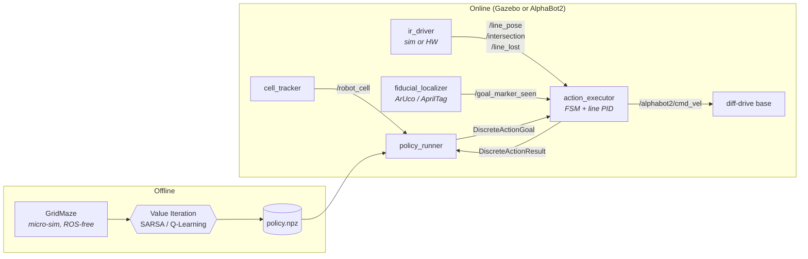

# Autonomous Maze Solving with MDPs and Model-Free RL

ROS 2 Humble workspace solving a discrete maze on the **AlphaBot2 with camera** using **Value Iteration**, **SARSA**, and **Q-Learning**.
Course project DMA, IST *Autonomous Systems* 2025/26.

## Team

- Gonçalo Silva (102995)
- Pedro Serradas (100065)
- Rodrigo Trindade (107224)
- Salvador Santos (100367)

## Problem

The maze is modelled as a Markov Decision Process $(S, A, p, R, \gamma)$ with state $s = (r, c, \theta)$, three actions $\{\texttt{forward}, \texttt{turn\_left}, \texttt{turn\_right\}}$, stochastic transitions ($p_s = 0.1$ slip per side), and goal-only reward.
The robot must follow $\pi(a\mid s)$ maximising

$$
V^\pi(s) = \mathbb{E}_\pi\!\left[\sum_{k=0}^{\infty}\gamma^k R_{t+k+1} \mid S_t = s\right].
$$

Three solvers are implemented:

| Method | Type | One-line summary |
| --- | --- | --- |
| Value Iteration | Model-based | Bellman optimality sweep — exact under known $P$, $R$. |
| SARSA | Model-free, on-policy | TD update along the trajectory actually taken. |
| Q-Learning | Model-free, off-policy | Bootstrapped greedy update — converges to $Q^\ast$. |

See [docs/mdp_design.md](docs/mdp_design.md) for the full specification.

## System architecture



The same closed-loop stack runs in Gazebo and on hardware; only the sensor producers differ.
The control layer is documented in [docs/control.md](docs/control.md).

## Repository layout

```
saut_dma_maze/
├── src/
│   ├── maze_mdp/        # MDP, RL algorithms, control FSM, ROS nodes, analysis
│   ├── maze_bringup/    # Launch files + YAML (no logic)
│   └── maze_msgs/       # Custom .msg / .srv (ament_cmake)
├── data/                # Training + deployment artefacts (gitignored)
├── docs/                # Design + deployment + control documentation
└── scripts/             # One-shot helpers (figure generation, etc.)
```

## Quick start

```bash
# One-time setup
source /opt/ros/humble/setup.bash
rosdep install -i --from-path src --rosdistro humble -y
colcon build --symlink-install
source install/setup.bash

# Train all policies (3 algos × 3 mazes × 5 seeds)
ros2 run maze_mdp sweep --config \
  $(ros2 pkg prefix maze_bringup)/share/maze_bringup/config/sweeps/default.yaml

# Replay a trained policy in Gazebo
ros2 launch maze_bringup gazebo_maze.launch.py \
  maze_name:=fixture_7x7_loop \
  policy_path:=$PWD/data/training/vi/fixture_7x7_loop/<run_id>/policy.npz

# Regenerate every report figure
bash scripts/make_all_figures.sh
```

See [docs/usage.md](docs/usage.md) for RViz visualization, side-by-side algorithm comparison, headless variants, and hardware deployment.

## Documentation map

| Document | Purpose |
| --- | --- |
| [docs/usage.md](docs/usage.md) | End-to-end recipes: build, train, RViz micro-sim, Gazebo, hardware. |
| [docs/mdp_design.md](docs/mdp_design.md) | State / action / reward / hyperparameter specification. |
| [docs/control.md](docs/control.md) | Action FSM, line-follow PID, sim-vs-hardware calibration. |
| [docs/data_schema.md](docs/data_schema.md) | Persisted artefact layout for reproducibility. |
| [docs/deployment.md](docs/deployment.md) | Hardware bring-up and recording protocol. |
| [docs/future_work.md](docs/future_work.md) | Deferred items with rationale. |
| [AGENTS.md](AGENTS.md) | Developer + AI-assistant conventions. |

A short Gazebo demo (VI on `fixture_7x7_loop`) lives in [docs/media/](docs/media/).

## References

- Sutton, R. S. & Barto, A. G. *Reinforcement Learning: An Introduction*, 2nd ed. MIT Press, 2018 — chs. 3, 6.
- Russell, S. & Norvig, P. *Artificial Intelligence: A Modern Approach*, 4th ed. Pearson, 2020 — ch. 17.
- Course materials: `Lab_guide_2526.pdf`, `Projects_2526.pdf`, `Apresentação 1 SAut.pdf`.

## License

Apache License 2.0 — see [LICENSE](LICENSE).
