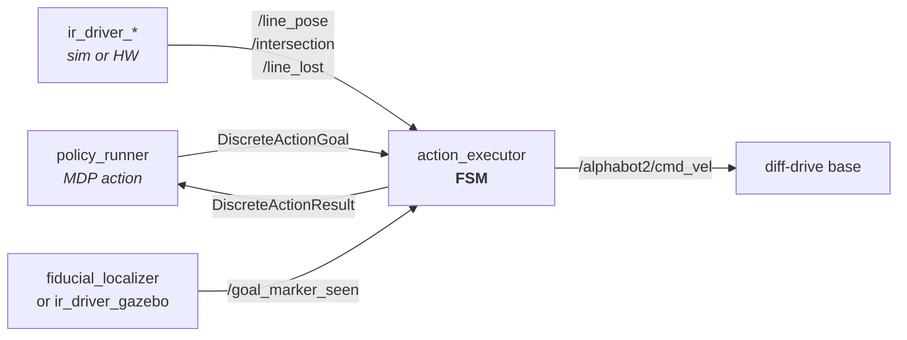
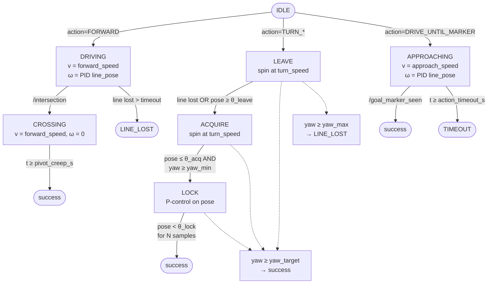

# Control Layer

How the discrete maze actions emitted by the MDP policy are turned into wheel commands on the AlphaBot2 (and its Gazebo twin).
The control layer is intentionally ROS-free; ROS nodes wrap it without touching algorithm logic.

Source files:

- [src/maze_mdp/maze_mdp/control/executor.py](../src/maze_mdp/maze_mdp/control/executor.py) — action FSM.
- [src/maze_mdp/maze_mdp/control/line_pid.py](../src/maze_mdp/maze_mdp/control/line_pid.py) — line-follow PID.
- [src/maze_mdp/maze_mdp/control/ir_geom.py](../src/maze_mdp/maze_mdp/control/ir_geom.py) — analytic IR/marker estimator (sim only).
- [src/maze_mdp/maze_mdp/nodes/action_executor.py](../src/maze_mdp/maze_mdp/nodes/action_executor.py) — ROS wrapper.

## 1. Architecture



The same FSM drives sim and hardware. Only the sensor producers differ:

| Source | Sim (Gazebo) | Hardware |
| --- | --- | --- |
| `/line_pose`, `/intersection`, `/line_lost` | `ir_driver_gazebo` (analytic, geometry-based) | `ir_driver` (TRSensors `readLine()`) |
| `/goal_marker_seen` | `ir_driver_gazebo` (proximity + facing) | `fiducial_localizer` (ArUco/AprilTag) |

## 2. Action FSM

Four discrete actions:

- `FORWARD` — line-follow to next intersection, then creep past so the wheel axle is centred on the cross.
- `TURN_LEFT` / `TURN_RIGHT` — spin in place, terminate when 90° of commanded yaw has accrued or the IR strip locks on the perpendicular line.
- `DRIVE_UNTIL_MARKER` — final-approach line-follow until the goal fiducial is seen.



### Why centring lives at the tail of `FORWARD`

The IR strip is mounted *forward* of the wheel axle, so `/intersection` fires while the axle is still ~one strip-to-axle distance behind the cross.
Centring inside a separate phase at the head of `TURN` failed on hardware: by the time the policy round-trip finished, the robot had braked to a stop and the creep barely moved the chassis.
Putting the creep at the tail of `FORWARD` (`CROSSING` substate) preserves momentum and reduces the calibration to a single scalar `pivot_creep_s ≈ d_strip→axle / forward_speed`.

### Why turns terminate on integrated yaw, not just IR lock

In Gazebo the synthetic `/line_pose` during a spin is generated analytically as `copysign(|sin(2·δ)|, -yaw_rate)`, with `δ` the deviation from the nearest cardinal heading.
Its sign is fixed by the spin direction, not by which side the line is on, so a pure P-controller in `LOCK` cannot correct overshoot.
Integrating commanded `|ω|·dt` to a `turn_target_yaw_rad` target gives a deterministic primary completion path; IR `LOCK` still runs and can finish earlier on hardware where `/line_pose` is geometrically grounded.

`gazebo_ros_diff_drive` only reaches ~80 % of commanded ω in steady state, so the sim launch bumps `turn_target_yaw_rad` to `π/2 / 0.80 ≈ 1.96`.
On real hardware the inner-loop motor driver tracks ω more closely; re-calibrate with a single "spin and observe" test, expected value near `π/2`.

## 3. Line-follow PID

[`LinePID`](../src/maze_mdp/maze_mdp/control/line_pid.py) is a discrete-time PID with derivative-on-measurement, first-order low-pass, anti-windup by conditional integration, and output saturation.
It runs at every `/line_pose` sample during `DRIVING` and `APPROACHING`.

### Tuning derivation

For small heading errors the line-follower plant is a 2nd-order LTI:

$$
\dot{\text{lat}} = v\,\theta, \qquad \dot\theta = \omega = -\frac{k_p}{W}\,\text{lat} - \frac{k_d\,v}{W}\,\theta
$$

giving

$$
\omega_n = \sqrt{\frac{v\,k_p}{W}}, \qquad \zeta = \frac{k_d}{2}\sqrt{\frac{v}{W\,k_p}}
$$

with $W$ = `line_capture_width` (4 cm, the IR strip half-width — both sim and hardware) and $v$ = `forward_speed` (0.10 m/s).
Targeting $\zeta \approx 0.7$ for a well-damped response gives $k_p = 1.2$, $k_d = 1.0$.
Integral action is left at zero in sim (D + line-loss-hold reject post-turn heading bias); on hardware add $k_i \approx 0.05\,$–$\,0.1$ only if a measurable steady-state drift remains after $k_p$/$k_d$ tuning.

### Line-loss handling

`on_line_pose(NaN)` and `on_line_lost()` **hold the most recent PID output** instead of zeroing the angular command.
The robot was almost certainly steering toward the line when the strip dropped out; zeroing the command lets it coast off tangent until `line_lost_timeout_s` fires.
Holding the last correction keeps it curving back toward the line. The timeout still arms.
This mirrors the hardware reference [Line_Follow.py](https://www.waveshare.com/wiki/AlphaBot2) and reduces the gap between sim and real driver behaviour.

## 4. Sim-specific: synthetic IR signal

`ir_driver_gazebo` synthesises `/line_pose` from `/virtual_odometry` plus the maze geometry (see [ir_geom.py](../src/maze_mdp/maze_mdp/control/ir_geom.py)).
When the robot is rotating in place at an intersection centre the analytic estimator returns `None` (heading outside every segment's parallel-tolerance window).
A synthetic excursion `pose = copysign(|sin(2δ)|, -yaw_rate)` is injected **only while `pose_val is None` and `|yaw_rate| > 0.4 rad/s`** so the executor's `LEAVE → ACQUIRE → LOCK` machinery still sees a usable waveform during the spin.

**The gating is critical.** An earlier version injected the spike whenever `|yaw_rate| > 0.2 rad/s` (easily triggered by ordinary PID corrections) and whenever the spike's magnitude exceeded the true pose. The spike's sign is opposite the correction direction, so it inverted the line-pose feedback during normal line-following on long straights — the robot drifted off the line monotonically until `line_pose` saturated to NaN and the executor (which then zeroed `ω`) coasted off forever. Fixed by gating strictly on `pose_val is None`. The hardware `ir_driver` has no equivalent injection.

## 5. Failure modes

| Condition | Result |
| --- | --- |
| FORWARD: no line for `line_lost_timeout_s` (0.5 s) | `LINE_LOST` |
| TURN: yaw past `turn_max_yaw_rad` without lock | `LINE_LOST` |
| Any state: stuck past `action_timeout_s` (8 s) | `TIMEOUT` |
| New action while one is in flight, or `abort()` | `ABORTED` |

Intersection events received inside `CROSSING`, `APPROACHING`, or `TURNING` are ignored.
Falling edges of `/goal_marker_seen` are ignored outside `APPROACHING`.

## 6. Key parameters

All knobs are dataclass fields on `ExecutorConfig` (algorithm) and `LinePIDConfig` (PID), exposed as ROS parameters by `ActionExecutorNode`.
Sim-specific overrides live in [src/maze_bringup/launch/gazebo_maze.launch.py](../src/maze_bringup/launch/gazebo_maze.launch.py).

| Parameter | Default | Sim | Meaning |
| --- | --- | --- | --- |
| `forward_speed` | 0.10 m/s | — | Line-follow + crossing linear speed. |
| `approach_speed` | 0.08 m/s | — | `DRIVE_UNTIL_MARKER` linear speed. |
| `turn_speed` | 0.60 rad/s | — | Spin rate in `LEAVE` / `ACQUIRE`. |
| `pivot_creep_s` | 0.45 s | — | Time spent in `CROSSING` after `/intersection`. Calibrate as `d_strip→axle / forward_speed`. |
| `turn_target_yaw_rad` | π/2 | 1.96 | Primary turn-completion criterion. |
| `turn_max_yaw_rad` | 2.50 | 2.80 | Hard cap; fail on over-rotation. |
| `line_p_gain` ($k_p$) | 0.8 | **1.2** | PID proportional. |
| `line_i_gain` ($k_i$) | 0.0 | 0.0 | Integral — leave at 0 in sim. |
| `line_d_gain` ($k_d$) | 0.0 | **1.0** | Derivative; sized for $\zeta \approx 0.7$. |
| `line_d_filter_tau` | 0.05 s | 0.04 | LPF on the derivative term. |
| `line_omega_clamp` | 2.5 rad/s | 1.8 | Output saturation. |
| `line_lost_timeout_s` | 0.5 s | — | `DRIVING` fails after this without a line. |
| `action_timeout_s` | 8.0 s | 12.0 | Global per-action timeout. |
| `control_rate_hz` | 20 Hz | — | `on_tick(dt)` rate. |

## 7. Validation

End-to-end Gazebo runs on all three fixtures (`fixture_3x3`, `fixture_5x5_corridor`, `fixture_7x7_loop`) reach the goal under a VI policy.
The 7×7 success run is recorded in [docs/media/7x7_success_test_row2_col3_heading1.mp4](media/7x7_success_test_row2_col3_heading1.mp4).

Unit tests: `src/maze_mdp/test/test_executor.py` covers FSM transitions, line-loss handling, yaw-target completion, and FSM pre-emption.

```bash
cd src/maze_mdp && python3 -m pytest -q
```

## 8. Hardware tuning checklist

1. **Strip-to-axle distance.** Measure with calipers; set `pivot_creep_s = d / forward_speed`. Verify FORWARD ends with the axle centred on a cross.
2. **Turn yaw target.** Command one TURN from a known heading, measure actual yaw change with a protractor or fiducial reference; scale `turn_target_yaw_rad` proportionally. Expected ≈ π/2.
3. **PID.** Start from the sim values ($k_p = 1.2$, $k_d = 1.0$, $k_i = 0$). If oscillation appears, drop $k_p$ first; if steady-state drift remains, add $k_i \approx 0.05$. Re-check the $\zeta \approx 0.7$ relation: $k_d = 1.4\sqrt{W k_p / v}$.
4. **Symmetry.** If left and right turns land asymmetrically, split `turn_target_yaw_rad` into per-side parameters.
