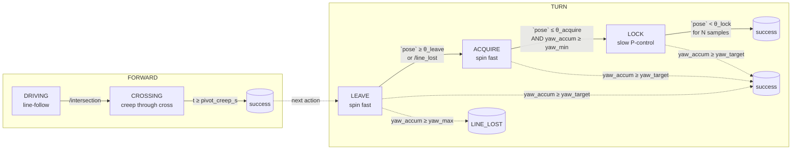

# Turn Controller — Cross-Centring FORWARD + 3-Phase IR Turn

This document describes how the discrete maze actions (`FORWARD`, `TURN_LEFT`, `TURN_RIGHT`, `DRIVE_UNTIL_MARKER`) are executed by [src/maze_mdp/maze_mdp/control/executor.py](../src/maze_mdp/maze_mdp/control/executor.py).
The executor is intentionally ROS-free; it is wrapped for ROS in [src/maze_mdp/maze_mdp/nodes/action_executor.py](../src/maze_mdp/maze_mdp/nodes/action_executor.py).
The same state machine drives both Gazebo and the AlphaBot2 hardware via the unified `/line_pose`, `/intersection`, `/line_lost`, `/goal_marker_seen` event stream.

Validated end-to-end on `fixture_3x3` (16 May 2026): VI policy, goal reached, turns landing within ~1° of the cardinal target.

## Problem statement

`/intersection` fires when **all five IR sensors** sit on a black line.
On the AlphaBot2 the IR strip is mounted **forward of the wheel axle**.
At the moment of the event:

- The IR strip is over the crossing.
- The wheel axle (rotation axis) is still ~one strip-to-axle distance *behind* the cross.

Spinning in place from that pose drags the strip off the crossing, the robot ends the turn straddling the wrong line, and cell-level tracking fails.

A first attempt at fixing this put the centring creep at the start of every `TURN_*`. That failed on hardware because FORWARD had already braked the robot to a stop on `/intersection`; the policy round-trip then introduced 50–200 ms of dead time before TURN started, by which point the creep from a dead stop barely moved the chassis.

## Architecture

Centring lives in the **tail of FORWARD**, so the robot maintains momentum through the crossing. TURN can then spin in place immediately, with no separate centring phase.



Two independent completion paths for TURN — whichever fires first wins:

1. **Yaw-integral target** (`turn_target_yaw_rad`, default `π/2`): primary completion criterion. Integrates the *commanded* `|ω|·dt`. Deterministic regardless of IR signal quality.
2. **IR pose lock** (`LEAVE → ACQUIRE → LOCK`): refinement that can finish earlier on the real robot, where `/line_pose` is geometrically grounded.

## State semantics

### FORWARD — `DRIVING` → `CROSSING`

| State | Behaviour | Exit |
| --- | --- | --- |
| `DRIVING` | `linear = forward_speed`, `angular = -line_p_gain · pose`. NaN pose → coast straight. | `/intersection` → `CROSSING`; `_t_since_line ≥ line_lost_timeout_s` → `LINE_LOST` |
| `CROSSING` | `linear = forward_speed`, `angular = 0`. Pose updates ignored (strip over a `+`). | `_t_crossing ≥ pivot_creep_s` → success |

Note that `/intersection` does **not** stop the robot in `DRIVING`. The robot keeps moving forward through the cross at full `forward_speed`, with no braking. `pivot_creep_s` is calibrated so that exactly when the timer expires, the wheel axle is over the crossing.

### TURN — `LEAVE` → `ACQUIRE` → `LOCK`

| Phase | Angular speed | Promotes to next phase when |
| --- | --- | --- |
| `LEAVE` | `turn_speed` | `|pose| ≥ turn_leave_threshold` OR `/line_lost` OR `pose == NaN` |
| `ACQUIRE` | `turn_speed` | `|pose| ≤ turn_acquire_threshold` AND `yaw_accum ≥ turn_min_yaw_rad` |
| `LOCK` | `turn_speed · turn_lock_speed_factor` with clipped P-control on pose | `|pose| < turn_lock_threshold` for `turn_lock_debounce` consecutive samples |

Cross-phase guards that apply throughout TURN:

- `yaw_accum ≥ turn_target_yaw_rad` → success (primary).
- `yaw_accum ≥ turn_max_yaw_rad` → `LINE_LOST` (safety cap).
- `_t_since_start ≥ action_timeout_s` → `TIMEOUT`.

The `_leave_seen` flag latches the `LEAVE → ACQUIRE` transition so a later return to the originating line cannot end the turn.

### `DRIVE_UNTIL_MARKER` (`APPROACHING`)

| Behaviour | Exit |
| --- | --- |
| `linear = approach_speed`, line-follow at reduced speed. `/intersection` ignored (the goal cell may be one cross beyond). | `/goal_marker_seen` (true) → success; `action_timeout_s` → `TIMEOUT`. Line loss is *tolerated* — the marker is the only stop condition. |

## Failure modes

| Condition | Result | Mechanism |
| --- | --- | --- |
| FORWARD: no line for `line_lost_timeout_s` | `LINE_LOST` | `_t_since_line` accumulator |
| TURN: over-rotation past `turn_max_yaw_rad` | `LINE_LOST` | yaw-integral safety cap |
| Any state: stuck past `action_timeout_s` | `TIMEOUT` | global timeout |
| External pre-emption (new action or `abort()`) | `ABORTED` | start/abort path |

Intersection events received during `CROSSING`, `APPROACHING`, or `TURNING` are ignored — the executor commits to the current sub-state and only its specific exit condition can end it. Falling edges of `/goal_marker_seen` are ignored outside of `APPROACHING`.

## Parameters

All knobs are dataclass fields on `ExecutorConfig` and ROS parameters on `ActionExecutorNode`. Sim-specific calibrations are applied in [src/maze_bringup/launch/gazebo_maze.launch.py](../src/maze_bringup/launch/gazebo_maze.launch.py).

| Parameter | Default | Sim override | Meaning |
| --- | --- | --- | --- |
| `forward_speed` | `0.10` m/s | — | Line-follow and crossing speed. |
| `approach_speed` | `0.08` m/s | — | Speed during `DRIVE_UNTIL_MARKER`. |
| `pivot_creep_s` | `0.45` s | — | Time spent in `CROSSING` after `/intersection`. **Calibrate to `strip_to_axle_distance / forward_speed`.** |
| `turn_speed` | `0.60` rad/s | — | Spin rate in `LEAVE` / `ACQUIRE`. |
| `turn_leave_threshold` | `0.5` | — | `|pose|` past which the strip has left the originating line. |
| `turn_acquire_threshold` | `0.5` | — | `|pose|` window for accepting the perpendicular line. |
| `turn_lock_speed_factor` | `0.25` | — | Fraction of `turn_speed` used during `LOCK`. |
| `turn_lock_threshold` | `0.15` | — | `|pose|` window for declaring centred. |
| `turn_lock_debounce` | `3` | — | Consecutive in-band samples to lock. |
| `turn_min_yaw_rad` | `1.10` | — | Lower bound on integrated yaw before `LOCK` is allowed. |
| `turn_target_yaw_rad` | `π/2 ≈ 1.5708` | `1.96` | **Primary** turn-completion criterion. |
| `turn_max_yaw_rad` | `2.50` | `2.80` | Safety cap; over-rotation past this fails the turn. |
| `line_p_gain` | `0.8` | — | P gain shared by `DRIVING` and `LOCK`. |
| `line_lost_timeout_s` | `0.5` s | — | `DRIVING` fails after this without a line. |
| `action_timeout_s` | `8.0` s | `12.0` | Global per-action timeout. |
| `control_rate_hz` | `20.0` Hz | — | Tick rate for `on_tick(dt)`. |

The FSM is symmetric in direction: `turn_direction = -1` (left, CCW) yields positive `ω`, `+1` (right, CW) yields negative `ω`.

### Sim-vs-hardware calibration

`gazebo_ros_diff_drive` reaches only ~80% of commanded ω in steady state due to inertia and the differential-drive plugin's first-order velocity response. A commanded-yaw integral of exactly π/2 therefore produces only ~73° of actual rotation, so `turn_target_yaw_rad` is bumped to `π/2 / 0.80 ≈ 1.96` in the Gazebo launch file.

On real hardware the wheels track commanded ω much more closely (the AlphaBot2 motor driver runs an inner-loop controller). Re-calibrate once with the "spin and observe" procedure below; expected value is near the default `π/2`.

## Why this design

### Why centre in FORWARD, not in TURN

- FORWARD has momentum: the robot is already moving forward at `forward_speed` when `/intersection` fires, so the creep through the cross is a simple velocity-hold rather than a restart from a stop.
- TURN can then spin in place from its first tick, with no policy-runner round-trip latency between centring and spinning.
- A single calibration constant (`pivot_creep_s = d_strip→axle / forward_speed`) captures the geometry.

### Why a yaw-integral target instead of pure IR pose

In Gazebo the synthetic `/line_pose` during a spin is generated analytically by [ir_driver_gazebo.py](../src/maze_mdp/maze_mdp/nodes/ir_driver_gazebo.py) as `copysign(|sin(2·δ)|, -yaw_rate)`, where δ is the deviation from the nearest cardinal heading. The **sign of this signal is fixed by the direction of rotation**, not by which side the line is on. So the LOCK phase's P-controller cannot correct overshoot — it can only stop on `|pose| < threshold`, which happens at every cardinal heading, not specifically the target one.

Adding the explicit `turn_target_yaw_rad` criterion makes the turn deterministic in sim and adds a robust hard target on hardware. The IR-based LOCK still runs and can finish a turn earlier than the yaw target if the geometric signal is clean.

### Why not use the camera for centring

A previous proposal was to detect or draw a forward line in the camera image and centre on it before spinning. We rejected this:

- At the crossing the camera sees a `+`, not a line; rejecting the perpendicular arm is brittle (shadows, glare, tape gaps).
- The camera cannot close the loop on the spin itself — the forward line leaves the FOV almost immediately.
- Camera frame rate on the Pi (~10–15 Hz) is an order of magnitude slower than the IR strip (~100 Hz).
- The 1-DOF longitudinal alignment problem is solved exactly by `pivot_creep_s`, a single calibrated scalar, applied where the robot has not lost momentum.

The camera is reserved for what only it can do: ArUco/AprilTag-based goal recognition during `DRIVE_UNTIL_MARKER` (see [fiducial_localizer.py](../src/maze_mdp/maze_mdp/nodes/fiducial_localizer.py)).

## Validation log (Gazebo, fixture_3x3, 16 May 2026)

VI policy `data/training/vi/fixture_3x3/20260514-185633-seed0/policy.npz`, start cell `(0, 0, E)`, goal `(2, 2)`.

```
dispatch goal_id=1 action=FORWARD       from (0,0,E)  -> success
dispatch goal_id=2 action=FORWARD       from (0,1,E)  -> success
dispatch goal_id=3 action=TURN_RIGHT    from (0,2,E)  -> success (ended yaw=-1.56, target -π/2 = -1.5708)
dispatch goal_id=4 action=FORWARD       from (0,2,S)  -> success
dispatch goal_id=5 action=DRIVE_UNTIL_MARKER from (1,2,S) -> success
Goal reached.
```

Before sim calibration the same TURN landed at `yaw = -1.27 rad` (off by 17°), causing the subsequent FORWARD to drift off the line. After bumping `turn_target_yaw_rad` to `1.96`, the turn lands within 1° of the cardinal target.

## Testing

[src/maze_mdp/test/test_executor.py](../src/maze_mdp/test/test_executor.py) — 28 tests, all passing:

- FORWARD `DRIVING → CROSSING → success` sequence, including the post-`/intersection` creep window.
- Pose updates during `CROSSING` do not steer.
- Full TURN `LEAVE → ACQUIRE → LOCK` sequence success (pose-based exit).
- TURN succeeds on yaw-integral target alone, without pose lock.
- Rejection of premature lock without excursion / before `turn_min_yaw_rad`.
- NaN / `/line_lost` promotion during `LEAVE`.
- Hard-fail on `turn_max_yaw_rad`.
- Action pre-emption, abort, idle-state no-ops, unknown-action error.
- `DRIVE_UNTIL_MARKER`: line-pose steering, intersection-ignored, line-loss-tolerant, marker-seen completion, marker-outside-approach no-op.

```bash
cd src/maze_mdp && python3 -m pytest test/test_executor.py -q
```

## Tuning checklist (hardware)

1. **Measure `d_strip→axle`** with calipers; set `pivot_creep_s = d / forward_speed` in seconds.
2. **Verify on a straight**: FORWARD should visually end with the wheel axle over the crossing, not before.
3. **Calibrate `turn_target_yaw_rad`**: command a single TURN_LEFT from a known heading, measure the actual yaw change. If the robot under-rotates, bump `turn_target_yaw_rad` proportionally; if over-rotates, reduce.
4. **Verify on a turn**: TURN_LEFT/RIGHT should re-acquire the perpendicular line near `|pose| ≈ 0`, not the originating line.
5. **If the bot overshoots during `LOCK`**: lower `turn_lock_speed_factor` to `0.15–0.20`, raise `turn_lock_debounce` to `4–5`.
6. **If the bot oscillates around the new line**: lower `line_p_gain` (shared with `FORWARD`).
7. **If turns time out**: confirm `turn_max_yaw_rad` is above `turn_target_yaw_rad` by a comfortable margin.

## Future work

- **Closed-loop centring.** Replace the open-loop `pivot_creep_s` timer with a falling-edge `/intersection_clear` event from the IR driver (or expose raw `/line_sensors` to the executor). Then `CROSSING` would end exactly when the strip *exits* the cross — meaning the axle is now under it — independent of `forward_speed` tuning.
- **Closed-loop yaw target.** Subscribe to the diff-drive plugin's actual wheel velocities (or use wheel-encoder odometry on hardware) and integrate measured ω instead of commanded ω. Removes the sim-vs-hardware calibration discrepancy.
- **Yaw recovery after turn**. If FORWARD immediately after a TURN loses the line, do a small sweeping yaw search instead of failing on `line_lost_timeout_s`. Not yet implemented because the yaw-target calibration above made it unnecessary in sim.
- **Per-side turn calibration**. Expose `turn_target_yaw_rad_left/right` if the AlphaBot2 motors prove asymmetric in turn execution.
