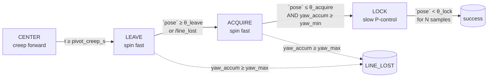

# Turn Controller — 4-Phase IR Turn FSM

This document describes how the discrete `TURN_LEFT` / `TURN_RIGHT` actions are executed by [src/maze_mdp/maze_mdp/control/executor.py](../src/maze_mdp/maze_mdp/control/executor.py).
It applies equally to Gazebo and to the AlphaBot2 hardware: the executor is ROS-free and consumes the same `/line_pose`, `/intersection`, `/line_lost` event stream in both.

## Problem

`/intersection` fires when **all five IR sensors** sit on a black line.
On the AlphaBot2 the IR strip is mounted **forward of the wheel axle**.
At the moment of the event, the *strip* is over the crossing but the *rotation axis* is still ~one strip-to-axle distance behind it.
Spinning in place from that pose drags the strip off the crossing and the robot ends the turn straddling the wrong line.

The previous single-pass logic (`turn_exit_min_excursion` followed by `turn_exit_pose`) was also fragile against:

- re-seeing the **same** originating line as the strip swings back across it,
- locking prematurely on a stray segment at ~30°, and
- noisy `/line_pose` samples near the threshold causing chattering exits.

## Approach

The turn is split into four phases.
States transition strictly forward; the originating line cannot end a turn because acquisition is gated on a commanded-yaw integral.



### Phase 1 — `CENTER` (axle alignment)

On `start(TURN_*, …)` the executor does **not** rotate.
It commands `linear = forward_speed`, `angular = 0` for `pivot_creep_s` seconds.
This drives the wheel axle onto the crossing.

`pivot_creep_s` is the only hardware-geometry constant in the FSM and is calibrated as
$$t_{\text{creep}} = \frac{d_{\text{strip→axle}}}{v_{\text{forward}}}$$
For the AlphaBot2 (`d ≈ 2 cm`, `v ≈ 0.10 m/s`), `pivot_creep_s ≈ 0.20 s`.

`/line_pose` samples during this phase are deliberately ignored — the strip sits on the cross and the signal is ambiguous.

### Phase 2 — `LEAVE` (commit to the spin)

Spin at full `turn_speed`.
Exit as soon as the strip has demonstrably left the originating line:

- `|pose| ≥ turn_leave_threshold` (line slipped under one of the outer sensors), or
- `/line_lost` / `pose == NaN` (line gone from under the strip entirely).

The transition is latched in `_leave_seen` so a later return to the originating line cannot end the turn.

### Phase 3 — `ACQUIRE` (wait for the perpendicular line)

Keep spinning at full `turn_speed`.
Promote to `LOCK` only when **both** conditions hold:

- `|pose| ≤ turn_acquire_threshold` — strip is back over a line, and
- `yaw_accum ≥ turn_min_yaw_rad` — enough rotation has accrued that the line under the strip cannot be the originating one.

`yaw_accum` is the integral of the *commanded* `|ω|·dt` (no IMU, no encoders).
With defaults `turn_min_yaw_rad ≈ 0.7 · π/2 ≈ 1.10 rad`, this rejects any line acquired at <40°.

### Phase 4 — `LOCK` (centre on the new line)

Drop angular speed to `turn_speed · turn_lock_speed_factor` (default `0.25 ×`).
Run a clipped P-controller on `pose`:
$$\omega = \mathrm{clip}\!\left(-K_p \cdot \text{pose},\ \pm\,\omega_{\text{lock}}\right)$$

Declare success when `|pose| < turn_lock_threshold` for `turn_lock_debounce` consecutive samples.
The streak counter resets on any out-of-band sample or NaN, which absorbs IR jitter cleanly.

### Safety bound — `turn_max_yaw_rad`

If `yaw_accum` exceeds `turn_max_yaw_rad` (default `~1.3 · π/2 ≈ 2.05 rad`) without locking, the turn fails fast with `FailureMode.LINE_LOST` instead of waiting on the global `action_timeout_s`.

## Failure handling

| Condition | Outcome | Mechanism |
| --- | --- | --- |
| No perpendicular line within ~1.3·π/2 of spin | `LINE_LOST` | `turn_max_yaw_rad` gate in `_turn_on_tick` |
| Strip leaves originating line then returns to it before `yaw_min` | turn keeps spinning | `_leave_seen` flag + `turn_min_yaw_rad` gate |
| Single noisy in-band sample | streak resets | `turn_lock_debounce` |
| Stuck FSM | `TIMEOUT` | global `action_timeout_s` |
| External pre-emption | `ABORTED` | `abort()` / starting another action |

`/intersection` events received mid-turn are ignored — the FSM commits to the spin once it leaves `CENTER`.

## Configuration

All knobs live on `ExecutorConfig` and are exposed as ROS parameters on `ActionExecutorNode`:

| Parameter | Default | Meaning |
| --- | --- | --- |
| `pivot_creep_s` | `0.20` | Forward creep duration before spinning. **Calibrate per chassis.** |
| `turn_speed` | `0.60` rad/s | Fast spin rate in `LEAVE` / `ACQUIRE`. |
| `turn_leave_threshold` | `0.5` | `|pose|` past which the strip has clearly left the line. |
| `turn_acquire_threshold` | `0.5` | `|pose|` window for accepting the perpendicular line. |
| `turn_lock_speed_factor` | `0.25` | Fraction of `turn_speed` used during `LOCK`. |
| `turn_lock_threshold` | `0.15` | `|pose|` window for declaring centred. |
| `turn_lock_debounce` | `3` | Consecutive in-band samples required to lock. |
| `turn_min_yaw_rad` | `1.10` | Lower bound on integrated yaw before `LOCK` is allowed. |
| `turn_max_yaw_rad` | `2.05` | Upper bound on integrated yaw before hard-failing. |
| `line_p_gain` | `0.8` | P gain shared with FORWARD line-follow; applied (clipped) in `LOCK`. |
| `action_timeout_s` | `8.0` s | Global action timeout. |

The FSM is symmetric in direction: `turn_direction = -1` (left, CCW) gives positive `ω`, `+1` (right, CW) gives negative `ω`. If the L/R motors are asymmetric on hardware, calibrate them at the motor driver layer rather than by adding separate `turn_speed_left/right` here.

## Why not the camera?

A previous proposal was to use the forward camera to draw / detect a guide line and centre the robot on the cross before spinning.
We rejected this in favour of the IR-based loop:

- At the crossing the camera sees a `+`, not a line; rejecting the perpendicular arm is brittle (shadows, glare, tape gaps).
- The camera cannot close the loop on the spin itself — the forward line leaves the FOV almost immediately.
- Camera frame rate on the Pi (~10–15 Hz) is an order of magnitude slower than the IR strip (~100 Hz).
- The 1-DOF longitudinal alignment problem is solved exactly by `pivot_creep_s`, a single calibrated scalar.

The camera is reserved for what only it can do: ArUco/AprilTag-based goal recognition during `DRIVE_UNTIL_MARKER` (see [fiducial_localizer.py](../src/maze_mdp/maze_mdp/nodes/fiducial_localizer.py)).

## Testing

[src/maze_mdp/test/test_executor.py](../src/maze_mdp/test/test_executor.py) covers:

- `CENTER` creep behaviour (no rotation, pose ignored, transition on timer).
- Full `LEAVE → ACQUIRE → LOCK` sequence success.
- Rejection of premature lock without excursion.
- Rejection of premature lock before `turn_min_yaw_rad`.
- NaN / `/line_lost` promotion during `LEAVE`.
- Hard-fail on `turn_max_yaw_rad`.
- Unchanged behaviour of `FORWARD` and `DRIVE_UNTIL_MARKER`.

Run with:

```bash
cd src/maze_mdp && python3 -m pytest test/test_executor.py -q
```

## Tuning checklist on hardware

1. Measure `d_strip→axle` (mm); set `pivot_creep_s = d / forward_speed`.
2. Verify `turn_leave_threshold` against the `line_pose_estimator` output — should be reachable in ~10° of spin.
3. If the bot overshoots the new line: lower `turn_lock_speed_factor` to `0.15–0.20`, raise `turn_lock_debounce` to `4–5`.
4. If the bot oscillates around the new line: lower `line_p_gain` (shared with `FORWARD`).
5. If turns time out: confirm `turn_max_yaw_rad` is above `π/2` plus a comfortable margin (default `2.05 ≈ 1.3·π/2`).
